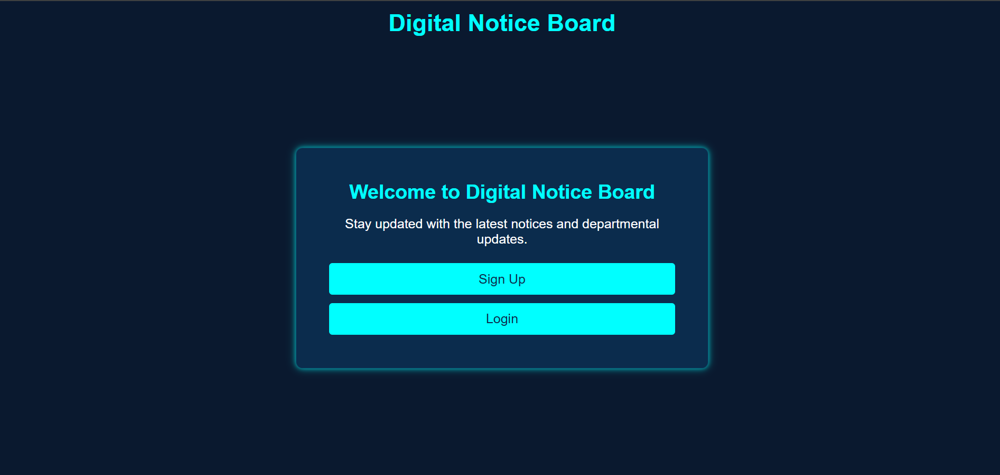
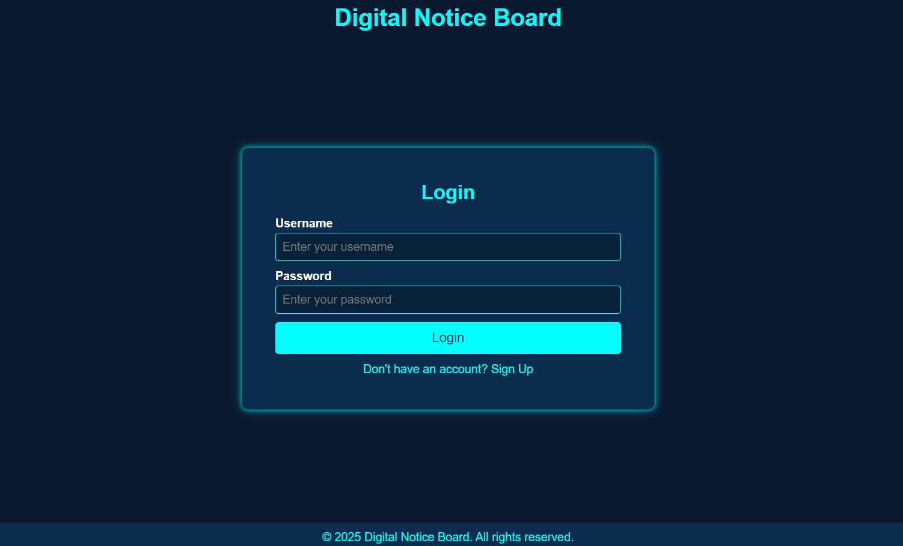
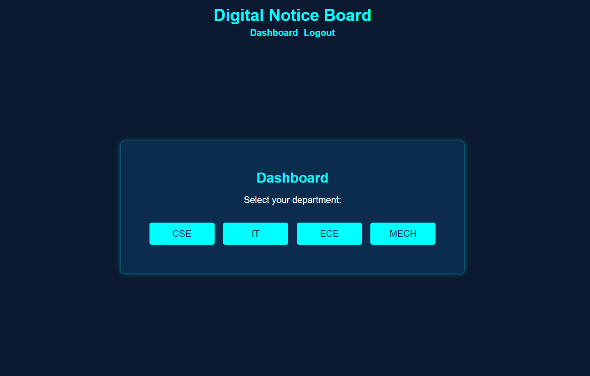
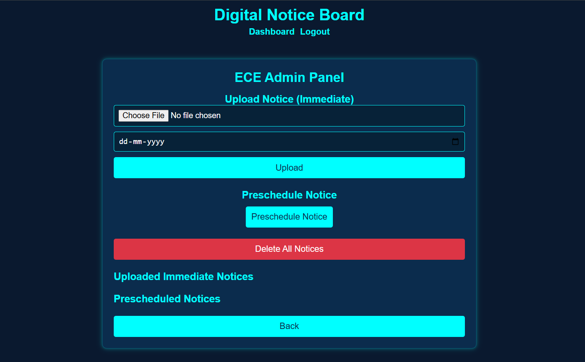
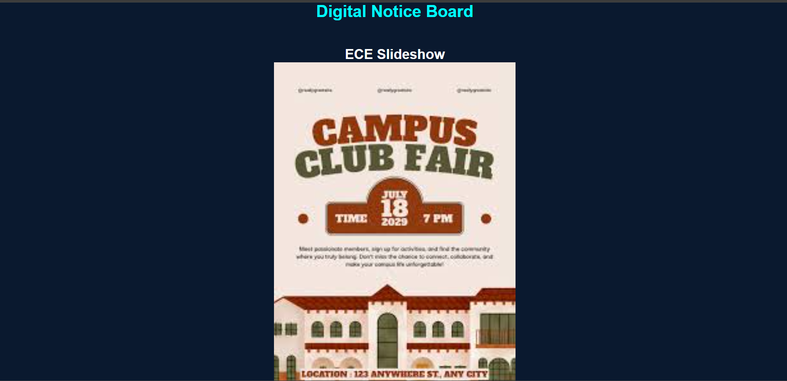
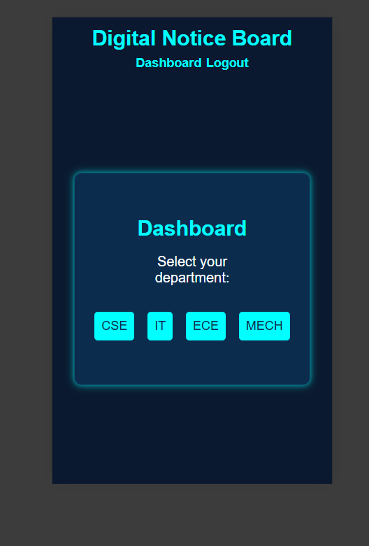

# 📢 Digital Notice Board System

A real-time **Digital Notice Board Web Application** built using Flask, Socket.IO, and SQLite.  
It allows admins to upload, schedule, and manage notices, while users can view them in a live slideshow format.

---

## 🚀 Live Demo

🔗 **Deployed on Render:**  
👉 https://digit-board.onrender.com

📺 Example Slideshow:  
👉 https://digit-board.onrender.com/slideshow/cse

---

## ✨ Features

- 🔐 User Authentication (Login / Signup)
- 🏢 Department-based Admin Panels (CSE, IT, ECE, MECH)
- 📤 Upload Notices (Image, Video, Audio, Documents)
- ⏰ Schedule Notices (Auto display at specific time)
- 🗑️ Delete Single / All Notices
- 📡 Real-time updates using Socket.IO
- 🖥️ Public Notice View
- 🎬 Slideshow Mode (Auto rotating display)
- 📱 Fully Responsive (Mobile Friendly)

---

## 🛠️ Tech Stack

- **Frontend:** HTML, CSS, JavaScript
- **Backend:** Flask
- **Database:** SQLite (SQLAlchemy)
- **Realtime:** Flask-SocketIO
- **Deployment:** Render

---

## 📂 Project Structure


📁 digital-notice-board
│
├── 📁 templates
│   ├── base.html
│   ├── index.html
│   ├── login.html
│   ├── signup.html
│   ├── dashboard.html
│   ├── admin.html
│   ├── schedule_notice.html
│   ├── public.html
│   └── slideshow.html
│
├── 📁 static
│   ├── styles.css
│   └── script.js
│
├── 📁 uploads
├── main.py
├── requirements.txt
└── README.md


---

## 📸 Screenshots

### 🏠 Home Page


### 🔐 Login Page


### 📊 Dashboard


### 🛠️ Admin Panel


### 🎬 Slideshow Display


### 📱 Mobile View


---

## ⚙️ Installation (Local Setup)

```bash
# Clone repository
git clone https://github.com/YOUR_USERNAME/digital-notice-board.git

# Navigate to project
cd digital-notice-board

# Create virtual environment
python -m venv venv

# Activate virtual environment
venv\Scripts\activate   # Windows

# Install dependencies
pip install -r requirements.txt

# Run application
python main.py
````

---

## 🌐 Usage

1. Open browser → `http://127.0.0.1:5000`
2. Signup / Login
3. Select department
4. Admin password format:

```
cse@22
it@22
ece@22
mech@22
```

5. Upload or schedule notices
6. View slideshow:

```
/slideshow/<department>
```

---

## 🎯 Future Enhancements

* 🔔 Email Notifications
* 📊 Admin Analytics Dashboard
* ☁️ Cloud File Storage (AWS S3)
* 👥 Role-based Access Control
* 📅 Calendar View for Scheduled Notices

---

## 🧠 Learnings

* Real-time communication using WebSockets
* File handling in Flask
* Database management with SQLAlchemy
* Deployment using Render
* Responsive UI design

---

## 👨‍💻 Author

**Suraj Golambade**

---

## ⭐ Show Your Support

If you like this project, give it a ⭐ on GitHub!

```
